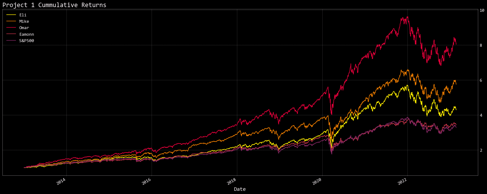

# Fintech_Project_1
#### Stock Portfolio Analysis: this project compares the performance of portfolios that are composed of different assets and weights. It includes different financial calculations, tables, and Monte Carlo simulations. The analysis will be on past and future performance of the portfolios, as well as suggestions for improving that performance.

## How to run the project

1. Clone the project locally:

     ```git clone https://github.com/omarmoreta/Fintech_Project_1.git```
     
2. Open the project and install required dependencies:
    
     ```cd Fintech_Project_1```
     
     ```pip install -r requirements.txt```
     
3. Delete ```.example``` extension from the ```.env.example``` file on the top-level to convert to ```.env``` file and add your alpaca api and secret keys. If you do not have an account you will need to sign up to generate keys. Reference: [Alpaca API Docs](https://alpaca.markets/docs/introduction/).

4. Next open the ```Portfolios``` directory and run cells in each jupyter notebook for financial analysis.

# Backstory (5 - 10)

> Why we did this
### - Eammon's real life portfolio as "jump off" point
> Method overall
### - In depth quantitative portfolio analysis.
### - Benchmark comparision.
### - "Under the hood" analysis of portfolio stocks
### - Clustering investigation for interaction between stocks

# Mike ( 4-5 )
# New Technologies/Libraries 
## 1. OpenBB terminal SDK
#### - Open source project, Bloomberg Terminal like data access & performance
#### - Uses publically available data sources as well as API access. Sources include Coinbase, FRED, Alpha Vantage
#### - Requires Python 3.8 or greater, pip install openbb
#### - https://docs.openbb.co/
## 2.  Riskfolio-Lib
#### - Portfolio optimization library using alogrithims and mathetmatical modeling
#### - pip install riskfolio
#### - https://riskfolio-lib.readthedocs.io/


# Eli

## Lets talk about risk
 What is <b>Risk</b>?  What is the context?

### Portfolio Risk
> ``` The possibility of losing money or missing out on investment goals and objectives ```

### How did risk factor into our portfolios?

> Risk plays an enormous factor in each of our investment portfolios.  You will see that some of our growth potential has to do with the level of exposure we have to specific industries.

> ``` How willing are you to lose it all? ```

### Return Spread
---


### How does that translate over 10 years?



## Class Betterment
---
### What are some ways to mitigate risk?

- Diversification
- Asset Allocation
- Risk Tolerance
- Hedging
- Time

# Omar ( 4-5 )

> Performance

> MonteCarlo

# Eamonn ( 4-5 )

> Dividends

# Review ( 30+ )

> Q/A (Dave & Co.)